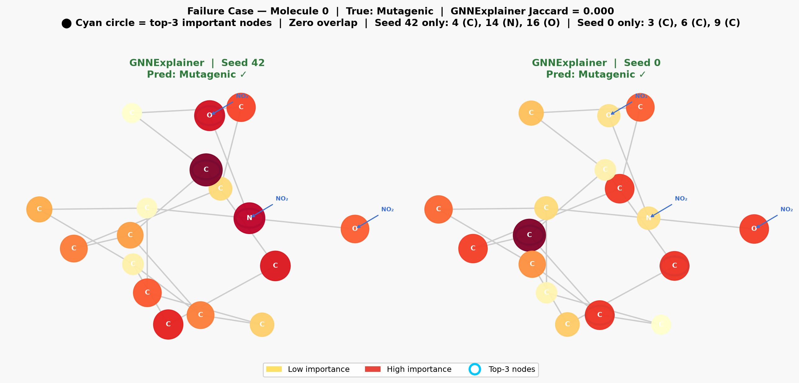
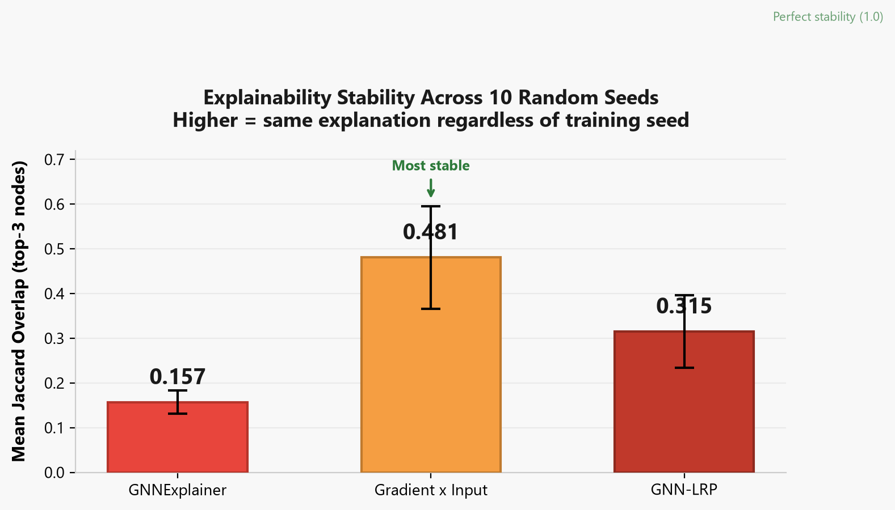
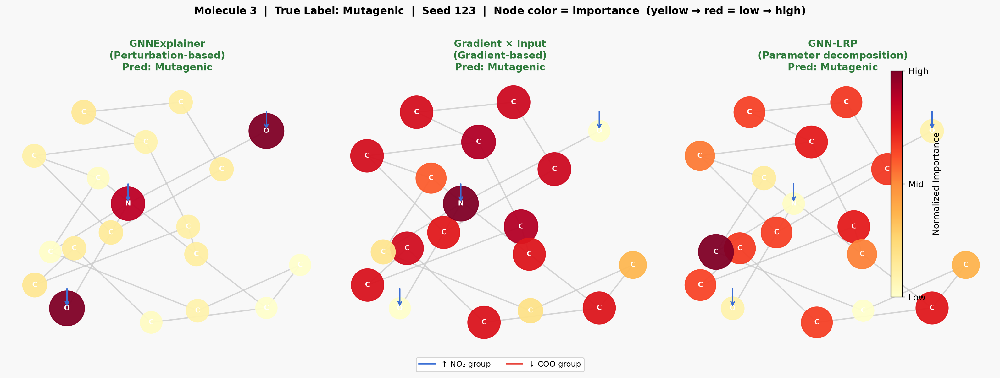

# MolTox-GCN: Explainability Stability in Graph Neural Networks

PyTorch Geometric implementation of molecular mutagenicity prediction on the MUTAG benchmark, with an empirical study on the reproducibility and stability of post-hoc GNN explanations across training seeds.

---

## Key Finding: GNNExplainer Is Sensitive to Random Seeds

Post-hoc explainability methods for Graph Neural Networks are widely used in drug discovery to identify toxicophores (chemical groups responsible for toxicity). However, explanations generated by optimization-based methods can vary substantially across models trained with different random initializations, even when both models achieve comparable validation performance.

Below is Molecule 0 evaluated across two independently trained models (Seed 42 vs Seed 0). Both models predict mutagenicity correctly, but GNNExplainer identifies completely disjoint sets of salient atoms.

<p align="center">
  
</p>

- **Seed 42 Top-3 Atoms:** Carbon 16, Nitrogen 4, Oxygen 14 (identifying the nitro functional group)
- **Seed 0 Top-3 Atoms:** Carbon 3, Carbon 17, Carbon 18 (identifying ring carbons on the opposite side)
- **Top-3 Subgraph Jaccard Similarity:** 0.000 (zero overlap)

This demonstrates that a single explanation from an optimization-based explainer can reflect seed-level stochasticity rather than an invariant chemical mechanism learned by the network.

---

## Stability Benchmark: Comparing Explainer Families

To evaluate whether this instability is specific to optimization-based methods, we benchmarked three distinct explainability paradigms across 10 random training seeds (seeds: 0, 1, 7, 13, 21, 42, 99, 123, 256, 512):

1. **GNNExplainer** (optimization-based): Learns a soft mask over edges and node features by maximizing mutual information with the model prediction.
2. **Gradient x Input** (first-order attribution): Computes input feature saliency via the elementwise product of input node features and output gradients.
3. **GNN-LRP** (propagation-based): Layer-wise relevance propagation modified for graph message passing layers.

### Stability Results (Pairwise Jaccard on Top-3 Subgraphs)

<p align="center">
  
</p>

| Method | Explainer Type | Mean Jaccard Across Seeds | Std Dev | Stability Rating |
|:---|:---|:---:|:---:|:---|
| **Gradient x Input** | Gradient Attribution | **0.481** | 0.290 | Most stable |
| **GNN-LRP** | Relevance Propagation | **0.315** | 0.339 | Moderate stability |
| **GNNExplainer** | Mask Optimization | **0.157** | 0.159 | Lowest stability |

Gradient-based attribution showed more than 3x higher cross-seed explanation overlap than GNNExplainer. Because Gradient x Input directly queries the first-order loss surface of the trained network, it avoids the non-convex optimization landscape that makes GNNExplainer sensitive to initialization.

---

## Chemical Ground Truth Validation

Despite cross-seed variance, GNNExplainer can accurately detect known toxicophores when optimization converges cleanly. For nitroaromatic compounds in MUTAG, the nitro group (-NO2) is the primary driver of mutagenic activity.

In Molecule 3, all three methods successfully localize the nitro group, identifying the nitrogen and oxygen atoms as the top contributors to the mutagenicity prediction:

<p align="center">
  
</p>

This highlights a key practical guideline: post-hoc graph explainers should be evaluated across multiple seeds or ensemble-averaged before relying on highlighted subgraphs for drug design decisions.

---

## Model Architecture

The classifier is a 3-layer Graph Convolutional Network (GCN) built with PyTorch Geometric:

```
Molecular Graph (Atoms = Nodes, Bonds = Edges)
       │
       ▼
┌─────────────────────────┐
│ GCNConv Layer 1 (7→64)  │  Maps atom feature vectors (one-hot element type) to latent space
│ + ReLU                  │
├─────────────────────────┤
│ GCNConv Layer 2 (64→64) │  Aggregates 2-hop neighborhood topology
│ + ReLU                  │
├─────────────────────────┤
│ GCNConv Layer 3 (64→64) │  Aggregates 3-hop neighborhood topology
│ + ReLU                  │
├─────────────────────────┤
│ Global Mean Pooling     │  Computes permutation-invariant graph-level representation
├─────────────────────────┤
│ Linear 1 (64→64)        │  Fully connected layer with ReLU and Dropout (p=0.5)
├─────────────────────────┤
│ Linear 2 (64→2)         │  Classification logits (non-mutagenic vs mutagenic)
└─────────────────────────┘
```

### Dataset & Training Setup

- **Dataset:** MUTAG (188 nitroaromatic compounds, 7 node features per atom)
- **Task:** Binary graph classification (mutagenic: 1, non-mutagenic: 0)
- **Train / Test Split:** 80% train (150 molecules), 20% test (38 molecules)
- **Optimizer:** Adam (learning rate = 0.01)
- **Training Epochs:** 100 per seed
- **Test Accuracy Range Across 10 Seeds:** 71.1% to 89.5% (Mean: 79.5%)

---

## Repository Structure

```
.
├── analysis.py              # Cross-seed failure case extraction and statistics
├── compare_stability.py     # Pairwise Jaccard stability metrics across explainers
├── explain_gnnexplainer.py  # PyG GNNExplainer runner
├── explain_gradient.py      # Gradient x Input attribution runner
├── explain_lrp.py           # GNN-LRP relevance propagation runner
├── generate_bar_chart.py    # Generates jaccard_stability_chart.png
├── model.py                 # MoleculeGCN architecture
├── train.py                 # Single-seed training script
├── train_multiseed.py       # Multi-seed training pipeline (10 seeds)
├── visualize.py             # Molecule graph visualization with highlighted subgraphs
├── figures/                 # Generated attribution plots and charts
├── models/                  # Saved model weights per seed (.pt)
└── results/                 # JSON files with explanation masks and stability scores
```

---

## Installation & Setup

### 1. Environment Setup

```bash
# Clone the repository
git clone https://github.com/Abhishekdhama/graph-molecular-classifier.git
cd graph-molecular-classifier/gnn_project

# Create and activate virtual environment
python -m venv venv
.\venv\Scripts\Activate.ps1    # On Windows PowerShell
# source venv/bin/activate     # On Linux / macOS
```

### 2. Install Dependencies

```bash
# PyTorch (CPU version; replace with appropriate CUDA wheel if GPU is available)
pip install torch torchvision --index-url https://download.pytorch.org/whl/cpu

# PyTorch Geometric and scientific visualization libraries
pip install torch-geometric matplotlib networkx rdkit
```

---

## Reproducing Results

### Train Across Multiple Seeds

```bash
python train_multiseed.py
```
This trains 10 models with seeds `[0, 1, 7, 13, 21, 42, 99, 123, 256, 512]` and saves weights into `models/`.

### Run Explainers

```bash
python explain_gnnexplainer.py
python explain_gradient.py
python explain_lrp.py
```
Outputs attribution scores and top-k masks into `results/`.

### Evaluate Cross-Seed Stability

```bash
python compare_stability.py
python generate_bar_chart.py
```
Computes mean Jaccard indices across all seed pairs and exports `figures/jaccard_stability_chart.png`.

### Generate Visualizations

```bash
# Generate side-by-side attribution figures for test molecules
python visualize.py

# Generate failure case analysis (Molecule 0 comparison across seeds)
python analysis.py
```

---

## Summary of Findings

1. **Seed Variance is Significant:** High validation accuracy does not guarantee stable explanations. Two models with identical architecture and comparable accuracy can yield zero overlap in their top-attributed subgraphs under GNNExplainer.
2. **Gradient Methods Exhibit Higher Stability:** Gradient x Input achieved a mean cross-seed Jaccard score of 0.481 compared to 0.157 for GNNExplainer, making it substantially more reliable for feature attribution without additional optimization overhead.
3. **Implications for AI in Chemistry:** In safety-critical applications like drug screening and toxicology, single-run GNN explanations should not be used in isolation. Multi-seed consensus or deterministic gradient baselines should be adopted to ensure attributed toxicophores are reproducible.
